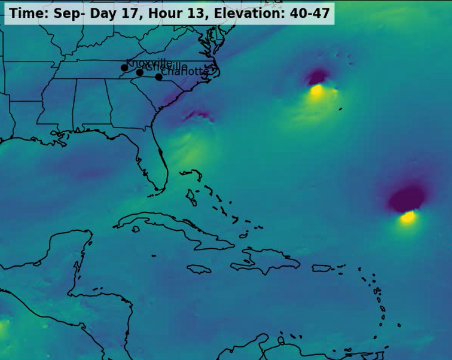
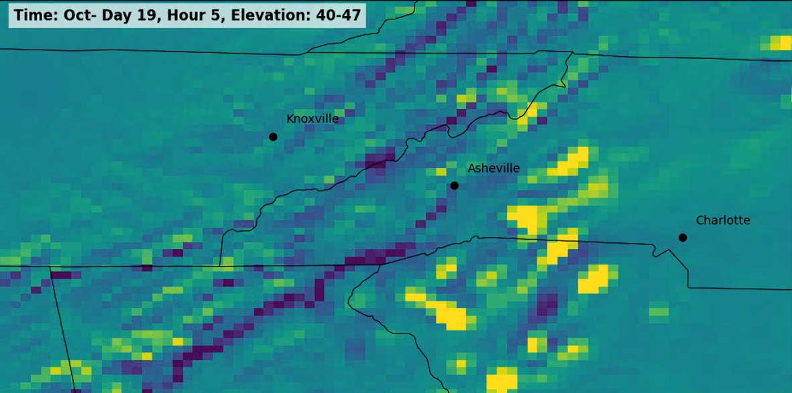
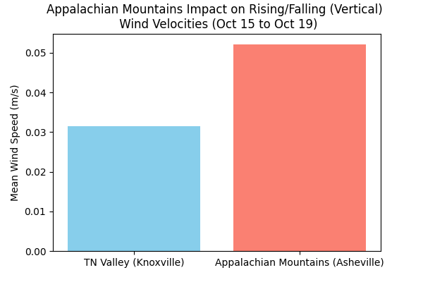

# CS-526: Data Engineering, Section 001, Final-Project, Reagan Sanz
Title: Wind Velocity and the impact of TN/NC Geography on Severe Weather
## Description ##
This Program creates a visualization of wind speeds and directions in the TN/NC area for use in analyzing the impact of the geography on severe weather events. It allows users to select specific start/end dates and wind directions, it then uses the DYAMOND 3 dataset to show a visualization of this region and save the results as an MP4 file. 
## Installation Instructions ##
- This code can be ran through Jupyter Notebooks.
- It requires: Python 3 (ipykernel), cartopy, OpenVisus, mpl_toolkits, MatPlotLib, and the 2025-Feb 2026 DYAMOND 3 dataset. 
- To Run: Press "play" at the top of each section. Requires Jupyter Notebooks (installed on PC, ran through Google Collab, etc). At the bottom of each section the output will be displayed.
### Requirements are as follows (already included in notebook code): ###
```
!pip install --user cartopy
!pip install --user opencv-python
!pip install --user ipywidgets
```
## Usage ##
- To Run: Press "play" at the top of each section. Requires Jupyter Notebooks (installed on PC, ran through Google Collab, etc).
- Edit the top cell to enter preferred wind directions, elevation, and month range.
- Note that generating the images (Section 2) will take upwards of an hour, especially if a large date range is selected. Its recommended to only view a month or two at a time.

## Example Outputs:
- Screenshot from the MP4 video showing West/East Winds forming Hurricanes in the coast

- Screenshot showing the impact of the Appalachian Mountains on Vertical wind velocies.

- Mean Wind Velocities Graph for October (Hurricane Season) for the TN valley vs. the Smoky Mountains


## Contact Information ##
Email: rsanz@vols.utk.edu GitHub: ReaganSanz

## Acknowledgements ## 
- CS 526 Write-Up Documents (Michela Taufer, University of Tennessee, Knoxville)  -
- Python Docs (https://docs.python.org/)
- DYAMOND GEOS sample notebooks (Aashish Panta (aashishpanta0@gmail.com))
- DYAMOND 3 Dataset (https://pcmdi.llnl.gov/research/DYAMOND3/)
- Cartopy Python Package (https://cartopy.readthedocs.io/stable/)
- Opencv Python Usage (https://www.kaggle.com/discussions/general/491147)
- Slider with ipywidgets (https://ipywidgets.readthedocs.io/en/latest/examples/Widget%20List.html)
- 
## References ##

### Cartopy ###
For visualization of Map and state/city lines.  
https://cartopy.readthedocs.io/stable/  
For plotting cities in South East region:  
https://medium.com/@s-vishnoi/map-data-visualization-how-to-plot-cities-cbsa-on-a-map-using-cartopy-36f74cc1cb05  

### Opencsv ###
For converting Multiple img files to a video file
https://www.kaggle.com/discussions/general/491147

### ipywidgets ###
For creating a slider to view data
https://ipywidgets.readthedocs.io/en/latest/examples/Widget%20List.html

### Others ###
For FINALLT figuring out how the Faces align/work: https://gmao.gsfc.nasa.gov/gmao-products/merra-2/images_merra-2/
